# Documentación del Proceso Contenedores en Conexión
# David Santiago Beltran Pedraza 
# Ficha: 3203084 - ADSO - CBA MOSQUERA
---

## 1. Se insala el wls para que Docker funcione y permita la ejecución de contenedores Linux en Microsoft.
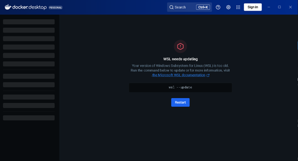
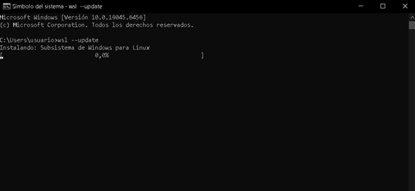
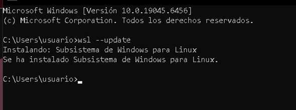

---

## 2. Se instalan las "images" de MySQL, MariaDB Y Postgres usando el comando docker pull (mysql por ejemplo). 
- El comando docker ps lo usamos para ver los contenedores que se han descargado.

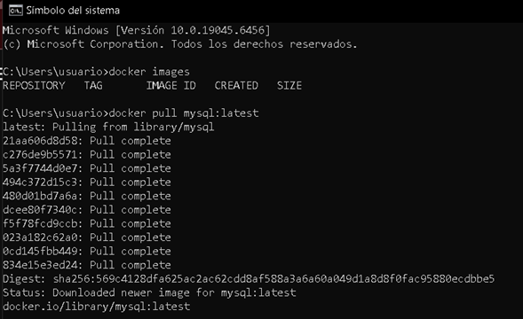
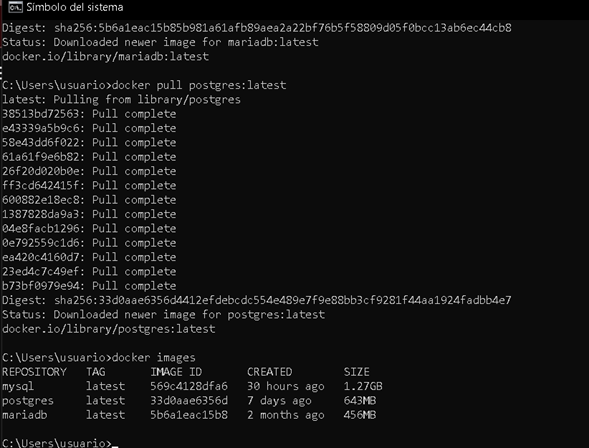

---

## 3. Se crean los contenedores para cada base de datos: MySQL, MariaDB Y Postgres.

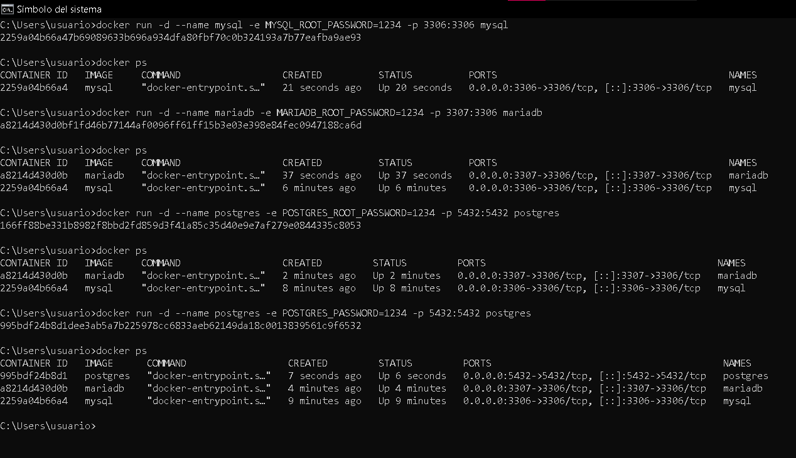

### Para cada base de datos se usaron los comandos:

- docker run -d --name mysql -e MYSQL_ROOT_PASSWORD=1234 -p 3306:3306 mysql
- docker run -d --name mariadb -e MARIADB_ROOT_PASSWORD=1234 -p 3307:3306 mariadb
- docker run -d --name postgres -e POSTGRES_PASSWORD=1234 -p 5432:5432 postgres

- En donde docker run es para crear y luego que se ejecute el contenedor.
- **--name** para seguido de este ponerle nuestro nombre a ese contenedor como se quiera llamarlo.
- **-e ...PASSWORD=1234** siendo el usuario y la contraseña a usar para el contenedor y que servirá al momento de enlazar con los clientes.
- **-p (0000:0000)** para la configuración de los puertos, en donde en mi caso MySQL servirá en el puerto 3306, MariaDB en el 3307 y Postgres en el 5432.

- Y finalmente se usa docker ps para ver que se hayan creado y ejecutado correctamente.

### Al igual se puede mirar en el Docker Desktop si están funcionando: 

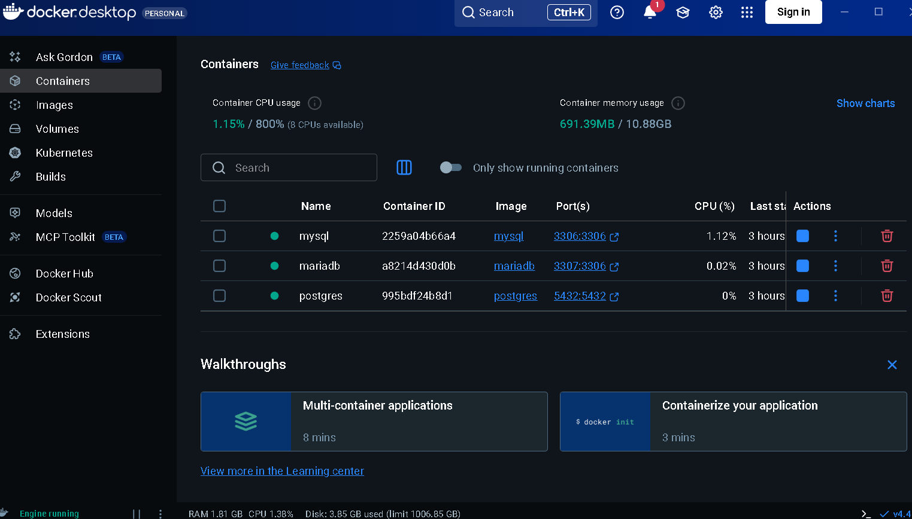

---

## 4. Instalamos los clientes SQL DBeaver, HeidiSQL y Beekeeper desde sus páginas oficiales.

---

## 5. DBeaver:
- Se abre el cliente de DBeaver y se hace la respectiva conexión en donde según los parametros que pusimos en el interprete CMD, la contraseña y el usuario se colocan según la base de datos a trabajar siendo puerto 3306(root) para MySQL, 3307(root) para MariaDB y 5432(postgres) para postgres.

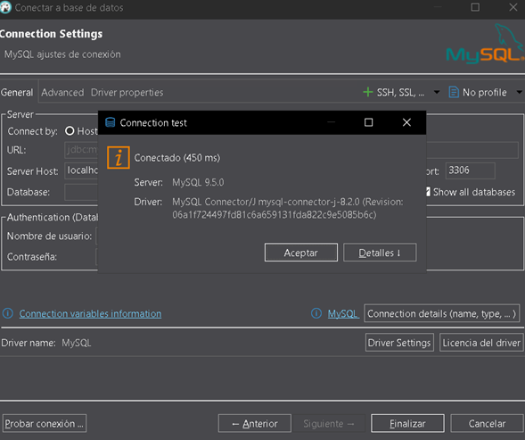
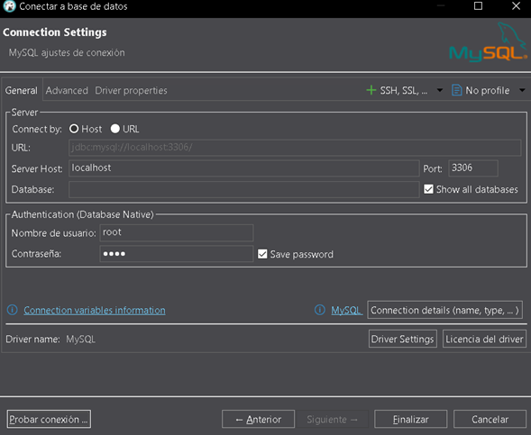
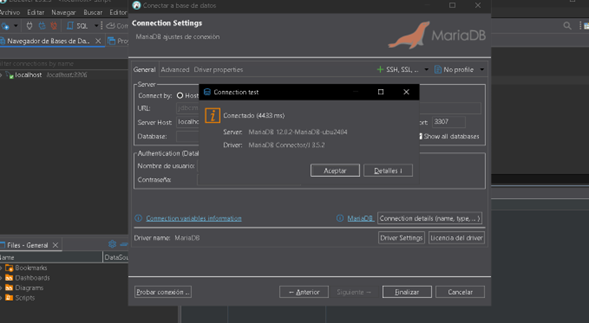

- Y adentro de cada localhost se crea la base de datos con su respectivo nombre usando el comando CREATE DATABASE db_dbeaver; y refrescando el servidor.

### Conexión y bases de datos:

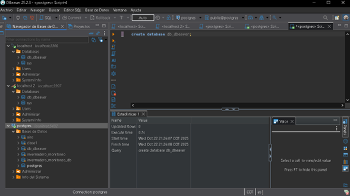

---

## 6. HeidiSQL:
- Mismo proceso que en el anterior solo que aquí al momento de crear la base de datos en cada servidor le ponemos db_heidisql.

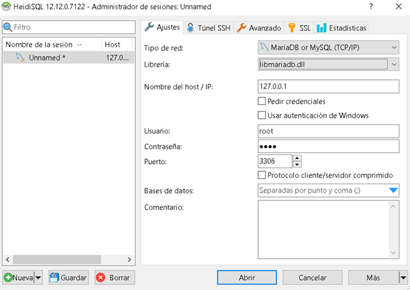
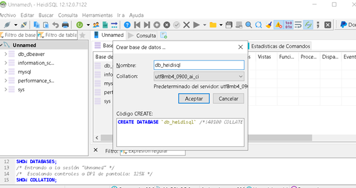

- Se me presenta un error que no me deja conectar el Postgres más sin embargo se logran conectar las otras dos:
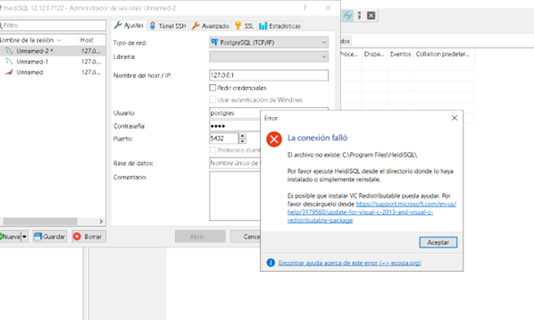

### Conexión y bases de datos:
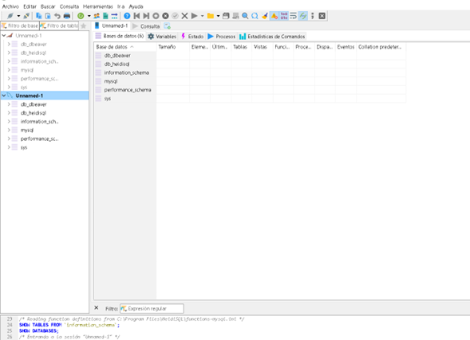

## 7. Beekeeper:

-Igualmente los 3 servidores se crean ingresando los parámetros que establecimos anteriormente en el interprete y se crean las bases de datos en cada uno en este caso db_beekeeper.

### Ejemplo de la conexión con el contenedor y pantallazos de las bases de datos conectadas en cada contenedor:

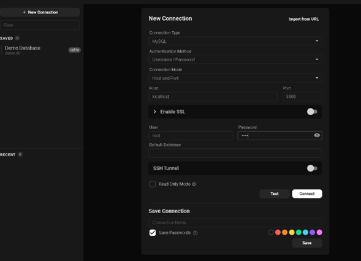
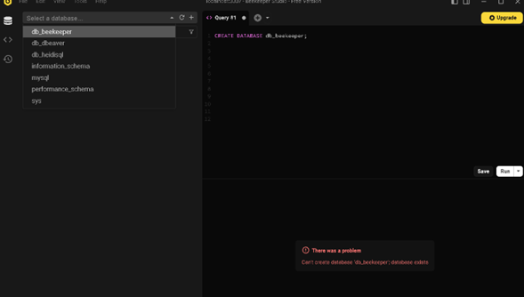
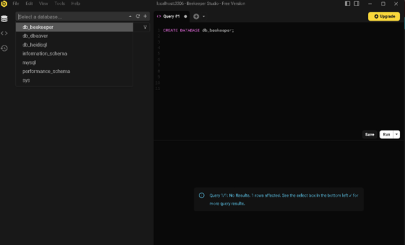
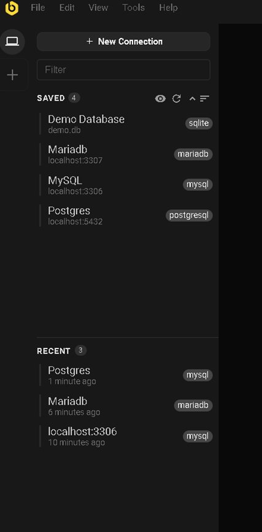

### Se muestra también ya las conexiones completas con todas las bases de datos en DBeaver y HeidiSQL (Excepto HeidiSql el postgres debido al error anteriormente comentado):
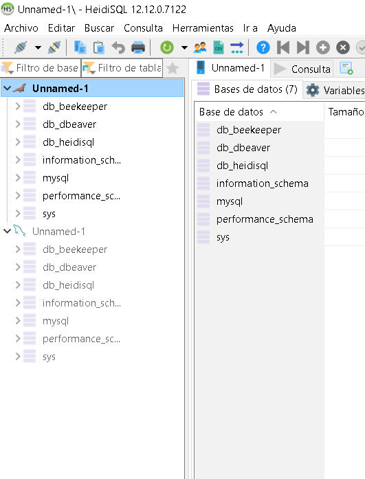
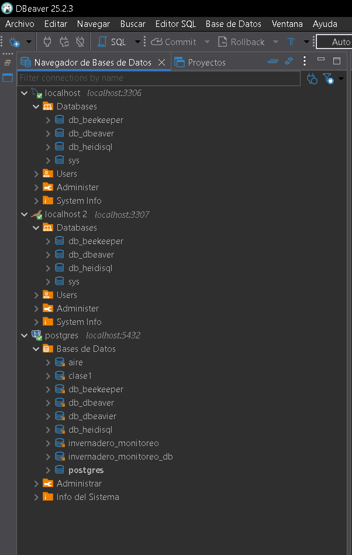

## Conclusiones: 
- Se realiza la actividad con la creación de los contenedores desde la terminal y conectandolos a cada contenedor y mostrando la conexión gracias también a las bases de datos que se fueron creando y que independientemente del cliente SQL en cualquiera se verán esas bases de datos (la unica excepción fue el postgres de Heidi con un error) pero que sería el mismo procedimiento mostrado en este mismo documento para la creación del mismo.