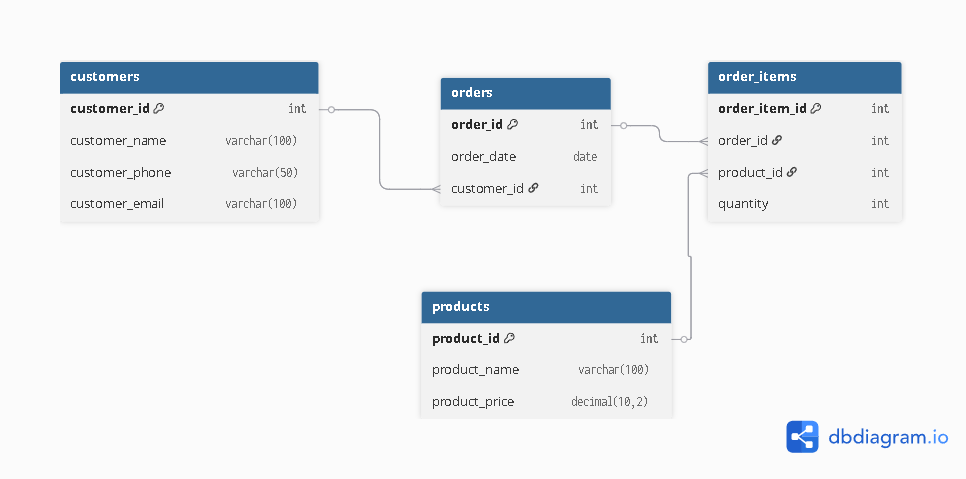
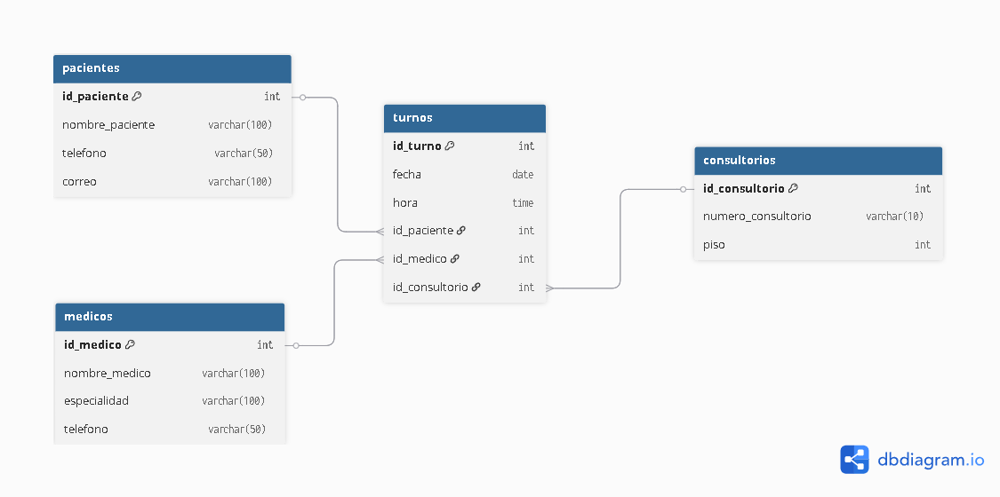

# Proyecto de Normalización de Bases de Datos
## David Santiago Beltran Pedraza
## Ficha: 3203084 - ADSO - CBA MOSQUERA

---

## Parte 1: Análisis conceptual – Devart

1. ¿Qué problema principal busca resolver la normalización en una base de datos y por qué es crítica en sistemas empresariales?

R/ Básicamente la normalización busca reducir la **redundancia de datos** en donde un mismo dato esta repetido en varias talas o filas, también busca que se mejoren problemas de **integridad** donde esta normalización busca que las dependencias entre los datos estén bien definidas. Ya que cuando una base de datos está desorganizada esta puede contener registros duplicados, errores y rendimiento lento los cuales también son justamente problemas que se buscan resolver con la normalización en bases de datos. 

Todos estos problemas en bases de datos son críticos en sistemas empresariales justamente por lo anteriormente comentado ya que todo esto puede causar complicaciones al actualizar información, generar reportes que puedan contener  información erronea o desactualizada, o simplemente causar problemas como al hacer mantenimiento en una base de datos que este desorganizada o sin esa normalización pues al realizar alguna operación en la base de datos como crear o eliminar algo en la estructura se puede a llegar afectar datos que hasta pueden no estar relacionados o que se pierda información, en pocas palabras se incrementa como ese riesgo de errores y más encima puede causar un funcionamiento más lento y menos eficaz en la base de datos por lo que al aplicar la normalización se mitigan todos esos problemas que se pueden ocasionar en las bases de datos de alguna empresa.

2. Describe con tus propias palabras las diferencias entre 1NF, 2NF y 3NF según los ejemplos del artículo.

R/ Las diferencias entre estas 3 primeras etapas de la normalizaciín son:

- **Primera forma normal (1NF):** Básicamente este primero se centra en que cada campo contenga un solo valor indivisible osea que no pueden existir listas, repeticiones o grupos de valores dentro de una misma celda y su objetivo es eliminar los grupos repetidos y garantizar que cada fila sea única e identificable.

Como ejemplo del artículo si un estudiante tiene los cursos “Matemáticas, Ciencias” en una sola celda, eso no cumple la 1NF. La solución sería crear una fila por cada curso que el estudiante tome pues cada campo debe contener un único valor.

- **Segunda forma normal (2NF):** En esta se comienza desde esa base de la 1NF pero ya no solo busca eliminar grupos repetidos sino que también busca eliminar la redundancia causada por dependencias parciales, es decir, cuando un atributo depende solo de una parte de la clave primaria (en lugar de toda la clave) y se aplica más que todo a tablas con claves compuestas.

En el ejemplo se repite el nombre y correo del estudiante en cada fila de curso, esos datos dependen solo del estudiante, no del curso y para cumplir con la 2NF se mueve esa información a una tabla ("Estudiantes" en el ejemplo) y se guarda solo el ID del estudiante en la tabla de cursos ya que los datos deben depender de toda la clave primaria, no de una parte.

- **Tercera forma normal (3NF):** Por último en este se parte desde la base de 2NF pero ya no existen dependencias transitivas osea que un atributo no clave no debe depender de otro atributo no clave, sino solo de la clave primaria Siendo su objetivo evitar que un dato se derive de otro dato dentro de la misma tabla, lo que puede causar inconsistencias.

Y como muestra el artículo si por ejemplo en una tabla de estudiantes se guarda “Código postal” y “Ciudad”, pero la ciudad puede determinarse solo a partir del código postal, entonces la ciudad depende del código postal y no directamente del estudiante. Para cumplir con la 3FN se debe mover “Código postal” y “Ciudad” a una tabla aparte de direcciones ya que los atributos no clave deben depender solo de la clave primaria, no de otros atributos.

- En conclusión básicamente la diferencia entre las 3 es que cada una exceptuando la primera se va basando de la anterior Norma Formal pero se añade otra regla por así decirlo en este caso en la 1NF se elimina grupos repetidos y garantiza atributos atómicos después se pasa a la 2NF, que se basa en la 1NF, donde se elimina las dependencias parciales (columnas no clave que dependen de una parte de la clave primaria) y se pasa a la 3NF, que se basa en 2NF, donde se elimina las dependencias transitivas (columnas no clave que dependen de otras columnas no clave). 

3. En los ejemplos de Devart, identifica una situación donde la normalización mejora la integridad de datos, pero podría afectar el rendimiento. Explica el motivo.

R/ Uno de los ejemplos del artículo es cuando separan los métodos de pago en la tabla nueva “PaymentMethods (OrderID, PaymentMethod)”. Este cambio forma parte de llevar la base de datos a 4NF (y antes 3NF/BCNF). En la original, en la tabla Orders se tenía campos PaymentMethod1, PaymentMethod2, lo que genera dependencias de múltiples valores y redundancias. 

Al mover los métodos de pago a una tabla separada, cada orden solo tiene tantos registros como métodos de pago tenga, no hay campos vacíos, no hay múltiples valores embebidos en una celda, se evita la repetición de “Cash”, “Voucher”, etc como parte de la tabla principal. Esto reduce anomalías de inserción, actualización, borrado: por ejemplo, si se necesitara añadir un tercer método de pago, no habría que modificar el esquema de la tabla Orders. Además, la integridad referencial (clave externa) asegura que cada método de pago corresponde a un OrderID existente y no se duplican métodos innecesarios.
Pero más sin embargo, al normalizar, cualquier consulta que necesite recuperar la información completa de un pedido y sus métodos de pago tendrá que hacer una join (una combinación) entre la tabla Orders y la tabla PaymentMethods y si se hacen consultas muy frecuentes (por ejemplo, un listado de órdenes con sus métodos de pago) esto implica más operaciones de unión, lo cual puede afectar el rendimiento (más lecturas, más índices, más exigencia computacional). Además, cuando hay muchas tablas y muchos joins, la latencia puede subir, los índices pueden requerir más mantenimiento, y la optimización de la consulta es más compleja, en pocas palabras básicamente por estar saltando de tbblas en tablas el rendimiento en el computador se puede ver afectado.

4. ¿Qué papel juegan las dependencias funcionales en el proceso de normalización y cómo las identificarías en una tabla?

R/ Las dependencias funcionales son la base teórica de los procesos de normalización. Una dependencia funcional ocurre cuando un atributo o conjunto de atributos, identifica o determina otro atributo en la tabla. Es decir: si A → B, entonces valor de A determina valor de B. 

En la normalización:

- En la 1NF no se habla como tal de dependencias funcionales, se habla más de valor atómico.

- En la 2NF se revisan las dependencias funcionales parciales: si hay una clave compuesta por ejemplo, (OrderID, ItemID), se revisa que ningún atributo no clave dependa únicamente de una parte de la clave donde identificamos si un atributo depende de toda la combinación o solo de una parte.

- En la 3NF se revisan las dependencias transitivas: un atributo no clave que depende de otro atributo no clave, que a su vez depende de la clave. Por ejemplo: OrderID → CustomerID → City. 

- En BCNF, se exige que cada determinante sea una clave candidata (candidate key). Si existe A → B, y A no es clave candidata, se viola BCNF como cuando ZipCode → City cuando ZipCode no es clave. 

Para identificar las dependencias funcionales de una tabla se siguen estos pasos:

- **Examinar las claves de la tabla:** identificar cuál es la clave primaria (o si hay clave compuesta).

- **Verificar cada atributo no clave:** Ver si el atributo está determinado por la clave o solo por una parte osea si la clave es (OrderID, ItemID) y un atributo Precio está determinado solo por ItemID, entonces hay dependencia parcial.

- **Verificar si algún atributo no clave determina otro atributo no clave:** Es decir si el atributo A → atributo B, y A no es clave. Si se encuentra, hay dependencia transitiva.

- **Verificar si alguna combinación de atributos no clave actúa como determinante de otro no clave y no es clave candidata:** En este caso se revisa BCNF.
Dentro del artículo, se muestran en la tabla los “Functional Dependency Explanation” (L611-L616) donde se listan cosas como “OrderID → Customer Info, Order Date …” “Customer Info → Name, Primary Phone …” “OrderID, ItemName → Price…” 

- **En la práctica, se puede revisar los datos:** buscar atributos repetidos, buscar si al cambiar un valor de la clave cambia el otro atributo, y si al cambiar otro no clave afecta otro. También se pueden usar herramientas de minería de dependencias o inspección manual de patrones de repetición.

Y asi las dependencias funcionales nos muestran cómo descomponer tablas, detectar dónde hay redundancia estructural, y guían la regla de qué debe depender de qué y evitar que dependa de algo incorrecto.

5. Explica, con tus palabras, cuándo sería justificable “desnormalizar” una base de datos según el contexto de negocio.

R/ Desnormalizar Básicamente es introducir alguna redundancia o agrupar datos en forma menos organizada con el objetivo de mejorar el rendimiento, sobre todo cuando la carga es de lectura intensiva o cuando se necesitan consultas de agregación/resumen de forma muy frecuente.
La desnormalización en una base de datos sería justificable más que todo cuando:

- El sistema es principalmente de lectura, no de escritura osea cuando los datos se consultan mucho, pero se modifican poco. Por ejemplo, dashboards, reportes, análisis de datos en esos momentos el evitar muchas uniones (joins) entre tablas puede mejorar ese tiempo de respuesta. 

- Se ejecutan muchas consultas de agregación, resumen o exploración de grandes volúmenes de datos, y el costo de uniones múltiples empieza a afectar la experiencia del usuario como cuando un portal de informes que muestra datos al instante y no puede esperar que el sistema combine 10 tablas cada vez.

- Según la prioridad del negocio es mejor la velocidad de acceso en vez de la mínima redundancia entonces ahí se acepta algun grado de redundancia para lograr que el sistema responda rápido.

- Además cuando se asume que los datos repetidos/duplicados no van a causar un gran problema de inconsistencias o mantenimiento o se implementan mecanismos para mitigar los riesgos de redundancia. 

---

## Parte 2: Caso Fred’s Furniture
### Retos y resultados

1. Reto 1 – Diagnóstico inicial: 

**Análisis de la tabla furniture_sales:**
Al copiar y ejecutar el contenido del archivo con la tabla furniture_sales podemos ver que presenta varias anomalías y que es una base de datos que no cuenta con las reglas de las bases de datos normalizadas pues esta contiene varios datos y columnas redundantes que impiden incluso que se puedan realizar acciones al intentar realizar alguna acción en la tabla.
Entre las anomalías podemos encontrar:

- **Anomalías de inserción**
No podemos insertar ciertos datos sin incluir información redundante o innecesaria como que para agregar un nuevo cliente con varios artículos o productos que se relacionen, se debe repetir información del cliente varias veces, lo que dificulta la inserción ordenada y evita registrar información parcial. Además justo por eso no podemos insertar más de 3 ítems por pedido sin modificar la estructura (la tabla fija item_1, item_2, item_3) básicamente si un pedido tiene 4 productos no cabe siendo algo repetitivo de columnas para ítems.

- **Anomalías de actualización**
Al modificar datos repetidos se deben actualizar en varias filas en este caso si cambia el teléfono de un cliente o el nombre de un producto por ejemplo, esta actualización debe hacerse en varias filas para evitar errores pero básicamente un fallo en la actualización puede dejar esos datos desactualizados o con información que ya no es la real en la base de datos.

- **Anomalías de eliminación**
Si se eliminara una fila se pierden datos importantes relacionados pero no deseados, como se puede ver si se elimina la única venta de un producto o cliente, se pierde toda la información de ese producto o cliente si no esta en alguna otra tabla y si uno quisiera tener una referencia más adelante de ese producto pues eso no se podría ya que ya no existirian esos datos, y esto ocurre en este caso por la falta de tabla products que esta separada; los datos del producto solo existen como columnas repetidas en forniture_sales.

- Pues básicamente todas estas anomalías son causadas por esa falta de normalización ya que como se menciono anteriormente la tabla mezcla información de ventas, clientes y productos en una sola, con campos multivaluados y redundantes lo que dificulta la integridad y la misma consistencia de los datos en la base de datos.

2. Reto 2 – Aplicación de 1NF:

Al ver las anomalías de los campos (item_1_id, item_2_id, etc.) que son campos redundantes para el tema de los productos y teniendo en cuenta que la 1FN dice que todos los campos sean atómicos yo propondría sería una estructura en la cual los campos que existan abarquen como tal todo en general de los datos es decir que en vez de por ejemplo item1_name, item2_name, pues básicamente solo crear un campo que sea por ejemplo items o orders y que en base a la id pues ya los otros campos se relacionan de una sola manera. La estructura sería:

- customers (customer_id PK, phone, email)

- orders (order_id PK, order_date, customer_id FK)

- products (product_id PK, name, standard_price)

- order_items (order_item_id PK, order_id FK, product_id FK, quantity, unit_price)

Si lo pasaramos a SQL un ejemplo en este caso con los mismos ítems sería:

CREATE TABLE order_items (
  order_item_id INT AUTO_INCREMENT PRIMARY KEY,
  order_id INT NOT NULL,
  product_id INT NOT NULL,
  quantity INT NOT NULL DEFAULT 1,
  unit_price DECIMAL(10,2) NOT NULL,
  FOREIGN KEY (order_id) REFERENCES orders(order_id),
  FOREIGN KEY (product_id) REFERENCES products(product_id)
) ENGINE=InnoDB DEFAULT CHARSET=utf8mb4;

3. Reto 3 – Aplicación de 2NF:

En la tabla se detectaron dependencias parciales como item_1_name, item_1_price, item_2_name, item_2_price, etc.,los cuales dependen directamente del identificador del producto (item_id), pero no del identificador del pedido (order_id).
Entonces si consideráramos como clave compuesta a (order_id, item_id), los campos del producto dependerían únicamente de item_id, generando así una dependencia parcial.

Al igual, los campos relacionados con el cliente (customer_phone, customer_email) dependen solamente de customer_id y no del pedido en sí.
Por esta razón, es necesario separar la información del cliente en una tabla propia (customers), mientras que los pedidos y productos deben organizarse en tablas diferentes.

Entonces una buena opción sería crear una tabla customers para almacenar los datos del cliente, una tabla orders para la información general de cada pedido, y una tabla order_items que relacione cada pedido con los productos que contiene.
Finalmente, se incluye una tabla products para los detalles únicos de cada producto (nombre y precio).

Se crearia la tabla customers para almacenar datos del cliente que dependían únicamente de customer_id.

Se crearia la tabla orders para representar el pedido, eliminando la redundancia de los datos del cliente y separando los pedidos por fecha.

Se crearia la tabla products para aislar la información del producto (nombre y precio), que dependían solo del product_id.

Y se crearia una tabla intermedia order_items para representar la relación muchos a muchos entre orders y products.

Al final mis tablas quedarían: 
CREATE TABLE customers (
  customer_id INT PRIMARY KEY,
  customer_phone VARCHAR(20),
  customer_email VARCHAR(100)
);

CREATE TABLE orders (
  order_id INT PRIMARY KEY,
  order_date DATE,
  customer_id INT,
  FOREIGN KEY (customer_id) REFERENCES customers(customer_id)
);

CREATE TABLE order_items (
  order_item_id INT PRIMARY KEY AUTO_INCREMENT,
  order_id INT,
  product_id INT,
  quantity INT DEFAULT 1,
  FOREIGN KEY (order_id) REFERENCES orders(order_id)
);

CREATE TABLE products (
  product_id INT PRIMARY KEY,
  product_name VARCHAR(100),
  product_price DECIMAL(10,2)
);

Básicamente mi desición de crear las tablas de esa manera sería así ya que con esta estructura y como anteriormente explique más profundamente, cada atributo depende completamente de su clave primaria, cumpliendo los requisitos de la 2FN.

4. Reto 4 – Aplicación de 3NF:

En este caso, los principales ejemplos son los siguientes:

En la tabla orders, el campo customer_id determina atributos del cliente como customer_phone y customer_email.
Esto significa que la información del cliente depende transitivamente de order_id a través de customer_id, por lo tanto, estos atributos deben separarse completamente.

Los precios y nombres de los productos (product_price, product_name) pueden depender del identificador del producto (product_id), y no directamente de order_id, por eso deben mantenerse en una tabla independiente de orders o order_items.

Estas dependencias transitivas provocan redundancia y posibles anomalías de actualización, por ejemplo, si se cambia el correo del cliente o el precio de un producto, habría que modificarlo en varias filas.

Entonces si rediseñamos la estructura y eliminanamos las dependencias transitivas asegurando que cada atributo dependa únicamente de la clave primaria de su tabla y así cumplir con la 3FN, el rediseño sería:

- **Tabla customers:** Contiene únicamente los atributos que dependen del identificador del cliente (customer_id) y eliminamos del resto de tablas todos los datos de contacto del cliente.

- **Tabla orders:** Esta contiene únicamente información del pedido y una referencia al cliente (customer_id) como clave foránea entonces ningún campo depende de atributos que no sean clave.

- **Tabla products:**  Esta contendra los datos del producto (nombre, precio) y cada producto tiene un identificador único (product_id) que evita nombres o precios duplicados.

- **Tabla order_items:** Por último esta sería como una tabla intermedia entre pedidos y productos, evitando repetir nombres o precios en cada pedido que contendria las claves foráneas (order_id, product_id).

Y así cada atributo queda completamente dependiente de su clave primaria, eliminando cualquier dependencia transitoria y las tablas finales con PKs y FKs quedarían:

CREATE TABLE customers (
    customer_id INT PRIMARY KEY,
    customer_name VARCHAR(100),
    customer_phone VARCHAR(50),
    customer_email VARCHAR(100)
);

CREATE TABLE orders (
    order_id INT PRIMARY KEY,
    order_date DATE,
    customer_id INT,
    FOREIGN KEY (customer_id) REFERENCES customers(customer_id)
);

CREATE TABLE products (
    product_id INT PRIMARY KEY,
    product_name VARCHAR(100),
    product_price DECIMAL(10,2)
);

CREATE TABLE order_items (
    order_item_id INT PRIMARY KEY,
    order_id INT,
    product_id INT,
    quantity INT DEFAULT 1,
    FOREIGN KEY (order_id) REFERENCES orders(order_id),
    FOREIGN KEY (product_id) REFERENCES products(product_id)
);

Y así esta estructura no tendría dependencias parciales (ya eliminadas en 2FN) ni dependencias transitivas, ya que ningún atributo depende de otro atributo que no sea clave logrando mayor integridad donde cosas como la información del cliente se actualiza en un solo lugar (customers), los productos y precios se controlan en la tabla products y Los pedidos solo almacenan la relación entre cliente y fecha, mientras que los detalles de cada artículo se guardan en order_items.

Esto ya siendo una base de datos más ordenada, eficiente y fácil de mantener, con total independencia entre las entidades y sin redundancia de datos.

5. Reto 5 – Modelo E-R final:
### Modelo E-R final

---

### Reglas de negocio

Pues según ya todo lo hecho en las tablas ya normalizadas las reglas de ese negocio que aplicarian serían:

1. Cada cliente puede realizar uno o varios pedidos, pero cada pedido pertenece a un solo cliente.

2. Cada pedido puede incluir uno o varios productos, y un mismo producto puede aparecer en distintos pedidos.

3. Los productos tienen un precio y nombre únicos identificados por su product_id.

4. No se pueden registrar pedidos sin cliente ni productos asociados.

5. La cantidad de cada producto en un pedido se controla mediante la tabla order_items, que representa la relación entre pedidos y productos.

6. La eliminación de un cliente o pedido elimina automáticamente sus pedidos o detalles asociados (gracias a las claves foráneas con la integridad referencial).

---

### Justificación del diseño

Aunque ya se explico en los retos el porque de las tablas o las desiciones tomadas ya más sintetizadamente todo ese diseño final se basa en las tres formas normales (1FN, 2FN y 3FN) para eliminar redundancias y dependencias que se encontraban en la tabla original del archivo furniture_sales, en donde:

- En la 1FN, se eliminaron los campos repetidos (como item_1_name, item_2_price, etc.), dejando atributos atómicos.

- En la 2FN, se separaron las dependencias parciales como la información del cliente se movió a una tabla independiente (customers), los productos a products, y los pedidos a orders.

- Y en la 3FN, se eliminaron las dependencias transitivas como los datos del cliente dependían indirectamente del pedido, quedando cada atributo dependiente solo de su clave primaria.

Y así llegamos a tener una base de datos más ordenada, consistente y fácil de mantener justamente aplicando la integridad, eliminación de redundancia y mayor flexibilidad para futuras consultas o actualizaciones en la base de datos y tablas del archivo.

---

## Parte 3: Proyecto personal
### Título y descripción
**Título:** Gestión de Turnos en una Clínica
**Descripción:** Este proyecto representa un sistema de una base de datos para la gestión de turnos médicos para una clínica.
Este mismo permite registrar los pacientes, médicos, consultorios y asignar turnos con la fecha y hora en el que se saca el turno.
El diseño se creo con la normalización hasta la 3FN para la misma integridad, evitando redundancias y facilitando la administración de los turnos para los pacientes.
### Diagrama E-R

### Reglas de negocio y justificación

**Reglas de Negocio:**

1. Cada paciente puede tener varios turnos, pero un turno pertenece solo a un paciente.

2. Cada médico puede atender varios turnos, pero cada turno tiene un único médico asignado.

3. Un consultorio puede ser usado en varios turnos, pero solo un turno a la vez.

4. No se puede registrar un turno sin paciente, médico y consultorio válidos.

5. Los datos de pacientes y médicos deben mantenerse actualizados, evitando duplicados.

6. Al eliminar un paciente, se deben eliminar también sus turnos asociados. 

**Justificación:** 

Este proyecto de una base de datos sobre la Gestión de turnos en una clínica aplica las tres primeras formas normales (1FN, 2FN y 3FN) en donde se intenta aplicar esa estructura lógica, coherente y sin redundancias en las tablas de la base de datos.

- En la 1FN se eliminaron los campos multivaluados y no atómicos en donde cada atributo almacena un solo valor, por ejemplo, cada paciente tiene un único teléfono y correo, y cada turno una sola fecha y hora.

- En la 2FN se eliminaron las dependencias parciales en el cual los datos que dependen directamente de una sola entidad se ubicaron en tablas independientes: pacientes guarda la información personal, medicos contiene los datos profesionales, consultorios almacena la ubicación y número de sala y turnos relaciona pacientes, médicos y consultorios mediante claves foráneas.

- En la 3FN se eliminaron las dependencias transitivas como en los datos del médico (nombre, especialidad, teléfono) dependen solo de id_medico, no del turno, por lo que se mantienen en su tabla igualmente con la información de pacientes y consultorios.

Y así se aplica una normalización en este proyecto donde se intenta ordenar de la mejor manera posible las tablas de la base de datos en donde se aplican desde la 1FN hasta la 3FN y se crea un sistema más eficiente o almenos ordenado y sin anomalias que causan generalmente la no normalización.